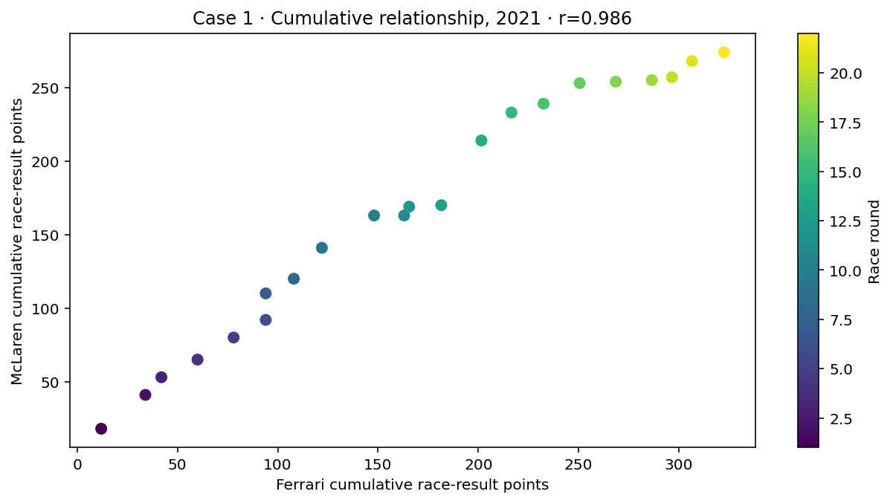
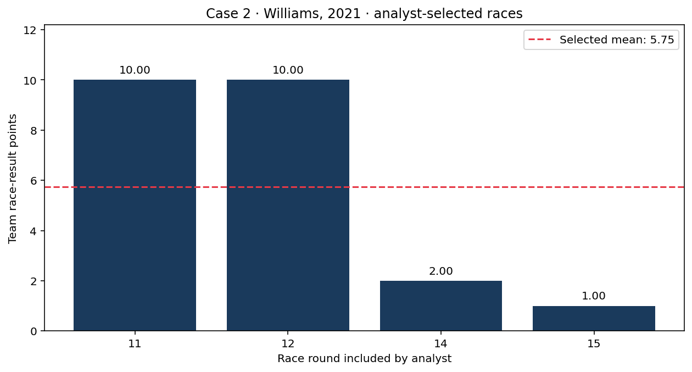
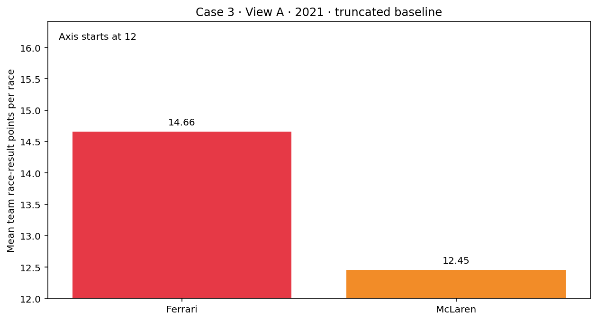

# Three analyses to audit

IIT414W · Friday 11 September 2026 · Unit I

The numbers in these cases come from the real local 2021 race-result snapshot. The analyst statements are fictional teaching claims to audit. They are not endorsed conclusions. All cases use race-result points, not cumulative championship standings or Sprint-weekend totals.

Work with a partner, but record your own initial judgement before discussion. For each case: identify the question and population, inspect the calculation, run a check, rewrite the claim and explain a remaining limitation. Naming a bias alone is not an answer. This is formative work, with no new grade.

Use the notebook for computations, or these cards and the CSV offline. The introductory block takes 35 minutes; the studio takes 60 minutes including a 10-minute break. Keep one conclusion from Thursday beside you for the final transfer.


## Case 1 · Do the teams move together?

### Analyst claim to audit

“Ferrari and McLaren have a correlation of 0.986. Their race-by-race performance moves almost perfectly together; a stronger Ferrari result is good news for McLaren.”



The analyst summed both drivers' points in each of the 22 races, ordered races by round, and accumulated the sums. Each plotted row is a season-to-date total after a race. No Sprint points were added.

```python
team_points = results.groupby(['round', 'constructor_id']).points.sum().unstack()
cumulative = team_points[['ferrari', 'mclaren']].sort_index().cumsum()
cumulative.corr()
```

### Audit · 15 minutes

1. Record whether the claim is supported and why, before computing anything new.
2. Are the units on the graph the units described in the claim? What changes automatically as rounds pass?
3. Produce a comparison that answers the race-by-race question. Show the statistic, axes and number of races.
4. Rewrite the claim without asserting more than the evidence supports. Does the new calculation establish cause, independence or a useful future predictor?
5. Ask your partner to challenge the rewritten claim. Keep the challenge and your revision or reason for retaining it.

Your record: initial judgement ___; check and result ___; revised claim ___; remaining limitation ___; feedback used ___.


## Case 2 · What is an average Williams race?

### Analyst claim to audit

“Williams averaged 5.75 points per race in 2021. Use that value to describe its output across the season.”



The analyst's included races are shown below. The source CSV also contains the other race entries.

|   Round |   Included team points |
|--------:|-----------------------:|
|      11 |                     10 |
|      12 |                     10 |
|      14 |                      2 |
|      15 |                      1 |

```python
williams = team_points['williams']
included = williams[williams > 0]
reported_mean = included.mean()
```

### Audit · 15 minutes

1. What population does the calculation actually describe? What population does the sentence claim to describe?
2. Count all races, included races and excluded races. Keep both drivers in each team total, including zero-point results.
3. Compute the mean for the intended population and the fraction of races with points. Do these describe the same quantity as the reported mean?
4. Explain the role of zero-point races. Should a retirement be removed, or be replaced by points the driver might have scored? Justify using the stated target.
5. Rewrite the claim and state why a historical mean is not automatically an expectation for a future season. Use your partner's feedback.

Retain fractional source points. A zero is not a missing record; a genuinely missing race must not be filled with zero without investigation.

Your record: initial judgement ___; population and counts ___; corrected statistic ___; revised claim ___; limitation/feedback ___.


## Case 3 · How large is the advantage?

### First impression · View A

Fictional analyst framing: “Ferrari's advantage is overwhelming. The chart settles which team should receive our hypothetical support budget.”



Both means use the same 22 races. Before opening View B, write your interpretation of the gap, your confidence in it, and what criterion would make the gap relevant to the budget decision. No objective or decision threshold has been supplied by the analyst.

Initial judgement ___; estimated size of gap ___; confidence, if useful ___; decision criterion you would need ___.

### Reveal only after recording the initial judgement

[Open View B](assets/case3_view_b_v1.png). It contains the same two values with another axis range. Do not overwrite your first response.

### Audit · 15 minutes

1. Check that values, population and units are identical. Identify what changed.
2. Compute the absolute gap and a percentage gap relative to McLaren. State the denominator.
3. Explain whether the initial framing or scale influenced your judgement. You may revise or retain it with evidence.
4. Produce a fair comparison for the stated question. Does a zero baseline prove that the difference is irrelevant? What else would a real decision require?
5. Distinguish a misleading visual cue from demonstrated anchoring in a person. A changed answer, or an unchanged one, does not by itself diagnose bias.

Your record: checked values ___; absolute/relative gap ___; final judgement ___; why revised or retained ___; peer feedback ___.


## Transfer to Thursday's work · 5 minutes

Choose one Thursday conclusion or your Ferrari–McLaren forecast update. Check its time scale, denominator and visual/verbal reference. Record one correction, or explain why the conclusion survives the check. Italy alone still does not resolve the original Italy + Spain forecast.

Record actual AI help and how you verified it, or a truthful no-use statement. Save your notebook and response record. Do not invent a change merely to show that feedback happened.

Source: local Jolpica results snapshot, 2019–2021; capture URLs, checksums and derivation in `data/samples/w02_fri_v1/source_manifest_v1.json`. These cases use 2021 because it is the most recent development year. No new network data is fetched. They are not estimates of 2026 team strength.
